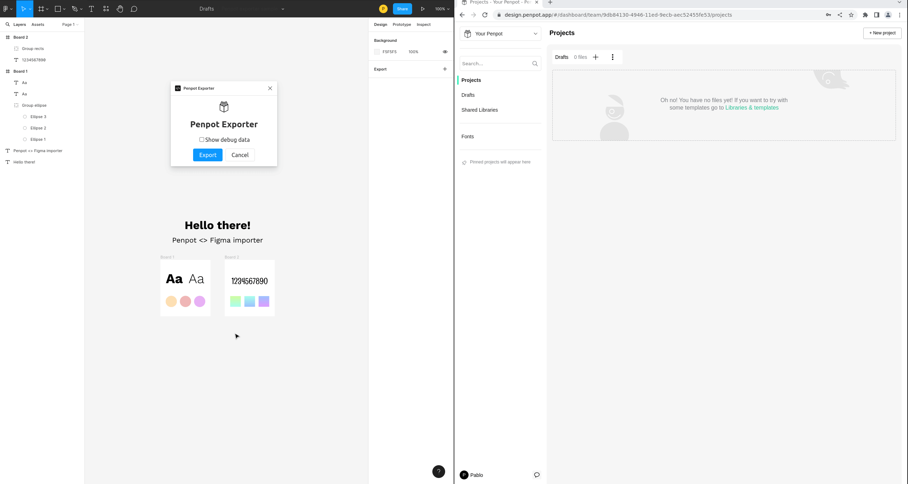

[uri_license]: https://www.mozilla.org/en-US/MPL/2.0
[uri_license_image]: https://img.shields.io/badge/MPL-2.0-blue.svg

<h1 align="center">
  <br>
  
  <br>
  PENPOT EXPORTER
</h1>

<p align="center"><a href="https://www.mozilla.org/en-US/MPL/2.0" rel="nofollow"></a>
<a href="https://tree.taiga.io/project/penpot/" title="Managed with Taiga.io" rel="nofollow"></a>
<a href="https://gitpod.io/#https://github.com/penpot/penpot" rel="nofollow"></a></p>

<p align="center">
    <a href="https://penpot.app/"><b>Penpot Website</b></a> •
    <a href="https://community.penpot.app/t/figma-file-importer/1684"><b>Export Figma to Penpot (penpot community)</b></a> •
    <a href="https://community.penpot.app/"><b>Penpot Community</b></a> •
</p>

<p align="center">
  
</p>


This is a **very early-stage** Figma plugin to export Figma files to Penpot format. For now is little more than a proof of concept, or a first scaffolding, not a fully functional exporter.

## Table of contents ##

- [Table of contents](#table-of-contents)
- [Why a Figma exporter](#why-a-figma-exporter)
- [Getting started](#getting-started)
  - [Prerequisites](#prerequisites)
  - [Install dependencies](#install-dependencies)
  - [Build the plugin](#build-the-plugin)
  - [Add the plugin to Figma](#add-the-plugin-to-figma)
  - [Launch the plugin and exporting a penpot file](#launch-the-plugin-and-exporting-a-penpot-file)
- [Call to the community](#call-to-the-community)
- [What can this plugin currently import?](#what-can-this-plugin-currently-import)
- [Limitations](#limitations)
- [Contributing](#contributing)
- [License](#license)

## Why a Figma exporter ##

The aim of this plugin is to help people migrate their files from Figma to [Penpot](https://penpot.app/). Migrating work from one design tool to another was never an easy task due to the abundance of closed and non-standard formats, and this is not a different case. Our approach to better solve this situation is to release a code skeleton for the minimum version of a Figma plugin that can convert a Figma file into a Penpot annotated SVG file.

There is a sense of urgency for this capability because there is a feeling that Adobe might force Figma to limit exports and interoperability via plugins very soon.


## Getting started ##

This plugin makes use of npm, webpack and react, and is written on TypeScript. It also includes a Penpot file builder library.

### Prerequisites
* node / npm

### Install dependencies
```
npm install
```

### Build the plugin
```
npm run build
```

### Add the plugin to Figma
`Figma menu` > `Plugins` > `Development` > `Import plugin from manifest…`

And choose the manifest.json file

### Launch the plugin and exporting a penpot file
`Figma menu` > `Plugins` > `Development` > `Penpot Exporter`

This will generate a .zip file that you can import from penpot

## Call to the community ##

Answering to the interest expressed by community members to build the plugin by themselves, at the Penpot team we decided to help solve the need without having to depend on our current product priorities. That is why we have published this bare minimum version of the plugin, unsatisfactory in itself, but it unlocks the possibility for others to continue the task.

Yes, we are asking for help. 🤗

We have explained this approach in a [community post](https://community.penpot.app/t/figma-file-importer/1684). Feel free to join the conversation there.

## What can this plugin currently import? ##

As mentioned above, this plugin gets you to a starting point. Things that are currently included in the import are:

- **Basic shapes** (rectangles, ellipses).
- **Frames** (Boards in Penpot).
- **Groups**.
- **Fills** (solid colors and linear gradients).
- **Texts** (basic support. Only fonts available on Google fonts).
- **Images** (basic support)

## Limitations ##
The obvious limitations are the features that are in Figma but not in Penpot or work differently in both tools so they can not be easily converted. We leave some comments below about the ones that are commonly considered more important:

- **Autolayout**: Not in Penpot yet but in a very advanced state of development. There will be news soon.
- **Components**: Currently very different from their counterparts at Figma. However, Penpot components are under a rework that we expect will make the conversion easier.
- **Variants**: Not expected in the short term. Also, we are thinking of different solutions to solve component states, things that eventually could make it difficult to import.


## Contributing ##

If you want to make many people very happy and help us build this code skeleton for the minimum version of the Figma plugin, a further effort will be needed to have a satisfactory import experience.

For instance, it will be interesting to add:
- Strokes
- Fills with radial gradients
- Paths
- Images (full support)
- Texts (full support)
- Rotations
- Constraints
- ...

Motivated to contribute? Take a look at our [Contributing Guide](https://help.penpot.app/contributing-guide/) that explains our guidelines (they're for the Penpot Core, but are mostly of application here too).


## License ##

```
This Source Code Form is subject to the terms of the Mozilla Public
License, v. 2.0. If a copy of the MPL was not distributed with this
file, You can obtain one at http://mozilla.org/MPL/2.0/.

Copyright (c) KALEIDOS INC
```
Penpot and the Penpot exporter plugin are Kaleidos’ [open source projects](https://kaleidos.net/products)
